# S7 Connector to CSV Application Example
Application example implementing CSV data extraction from PLC data sources, by the mean of Industrial Edge Databus, S7 Connector and Industrial Edge Flow Creator applications of SIEMENS Industrial Edge platform.

- [S7 Connector to CSV Application Example](#s7connector-to-csv)
  - [Introduction](#introduction)
    - [Before starting](#before-starting)
  - [Requirements](#requirements)
    - [Used components](#used-components)
    - [Hardware requirements](#hardware-requirements)
    - [Software requirements](#software-requirements)
  - [Application example](#application-example)
    - [Description](#description)
    - [Prerequisites](#prerequisites)
    - [Configuring data exchange with SIMATIC S7 Connector and IE Databus App](#configuring-data-exchange-with-simatic-s7-connector-and-ie-databus-app)
      - [ConnectionMap creation for Mapping Name Tag - Id Tag](#connectionmap-creation-for-mapping-name-tag-id-tag)
    - [Writing data from IE Databus with MQTT protocol to CSV file](#writing-data-from-ie-databus-with-mqtt-protocol-to-csv-file)
      - [Bulk message receiving from MQTT](#bulk-message-receiving-from-mqtt)
      - [Dashboard for displaying CSV monitoring with IE Flow Creator](#dashboard-for-displaying-csv-monitoring-with-ie-flow-creator)
      - [Download the CSV file from IED Application Volumes](#download-the-csv-file-from-ied-application-volumes)
  - [Documentation](#documentation)
  - [Contribution](#contribution)
  - [License & Legal Information](#license--legal-information)

## Introduction 
The aim of this application example is to save data extracted from field devices (such as PLCs) into a CSV file, usable for further processing or for data sending to remote systems, users or applications.

As shown in the figure below, the application example consists in the usage of three different applications:
* Industrial Edge (IE) Databus;
* SIMATIC S7 Connector;
* Industrial Edge (IE) Flow Creator.

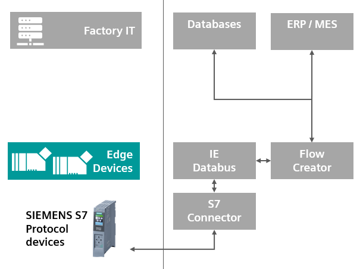

### Before starting

Before proceeding, please consult the necessary requirements in paragraph [Requirements](#requirements). 

For all the details regarding the use of IE Databus, SIMATIC S7 Connector and IE Flow Creator applications, see chapter [Documentation](#documentation) containing links to online references and support.

The application example is supplied together with a file named [flows_S7toCSV.json](examples/flows_S7toCSV.json), which is a flow showing how to manage data extraction and saving into CSV file through IE Flow Creator app (based on Node-RED). 

## Requirements
### Used components
* Industrial Edge Management (IEM) V1.4.3
* Industrial Edge Device (IED) V1.3.0-57
### Hardware requirements

IE Databus, SIMATIC S7 Connector and IE Flow Creator applications are only compatible with SIEMENS devices that have **Industrial Edge** functionality enabled.

### Software requirements

The RAM required by the three mentioned applications is listed below:

| **Application name** | Version   | **Memory limit** |
|	---------------------|:---------:|--------:|
| IE Databus           |	1.4.16   |  310 MB |
|	SIMATIC S7 Connector |  1.4.10   |  860 MB |
|	IE Flow Creator      |  1.2.2    |  640 MB |

For previous versions of the applications, the RAM requirements might change.

## Application example

### Description

The aim of this application example is to implement various functionalities:
* Configuration of **data exchange with SIMATIC S7 Connector and IE Databus** apps;
* **Data writing** from IE Databus with MQTT protocol **into a CSV file**;
* **Dashboard for CSV file writing enabling, disabling and monitoring via IE Flow Creator**.

### Prerequisites

* To enable communication with an S7 data source, a **PLC** of the SIMATIC family (S7-300, S7-1200. S7-1500,…);
* The **SIMATIC S7 Connector** application must be installed and configured on the edge device used;
* The **IE Databus** application must be installed and configured on the edge device used;
* The **IE Flow Creator** application must be installed on the Edge Device being used;
* The [flows_S7toCSV.json](examples/flows_S7toCSV.json) file must be imported into the SIMATIC Flow Creator application using the `Import` functionality from the dedicated menu.

### Configuring data exchange with SIMATIC S7 Connector and IE Databus App

In order to save information into a CSV file, it is first necessary to exchange data with a data source capable of cyclically generating new values.

In this application example, the use of a **SIMATIC S7 PLC** data source is considered, configured within the **SIMATIC S7 Connector** application by entering the properties necessary for the communication and the list of variables to be monitored.

In this case, within the S7 Connector application an **S7-1500 CPU** has been configured as a Datasource with S7 protocol and with **Bulk Publish** data publishing mode.

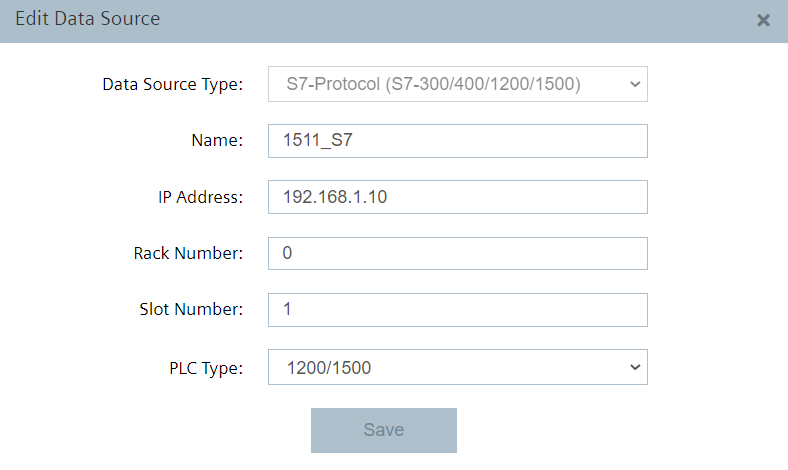

**Bulk Publish** mode can be set via `Settings` button in the S7 Connector configuration interface, together with the user and password used to connect to the MQTT broker of the SIMATIC IE Databus application. 

In this example we will use `edge` user and `edge` password, as can be seen from the images below.

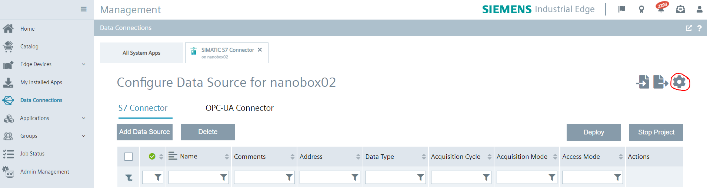

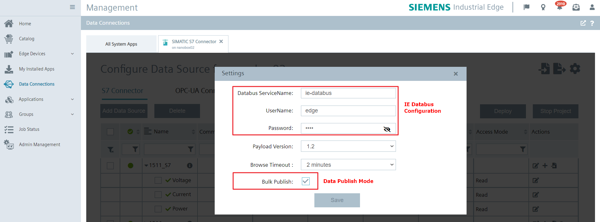

For the purpose of this application example, three variables will be considered, summarized in the following table:

| **Datapoint Id**      |	**S7+ Address**     	| **Data Type** |**Acquisition Cycle**|**Acquisition Mode**|**Access Mode**|
|:----------------------|:----------------------|:--------------|:--------------------|:-------------------|:--------------|
| Voltage	|	%DB13.DBD0		|     Real | 500 ms | CyclicContinuous  | Read          |
| Current	|	%DB13.DBD4		|     Real | 500 ms | CyclicContinuous  | Read          |
| Power	  | %DB13.DBD8	  |	    Real | 500 ms | CyclicContinuous  | Read&Write    |

The result of data source and tags configuration within S7 Connector application is shown in the image below, displaying the `Data Connections` section of the Industrial Edge Management system.

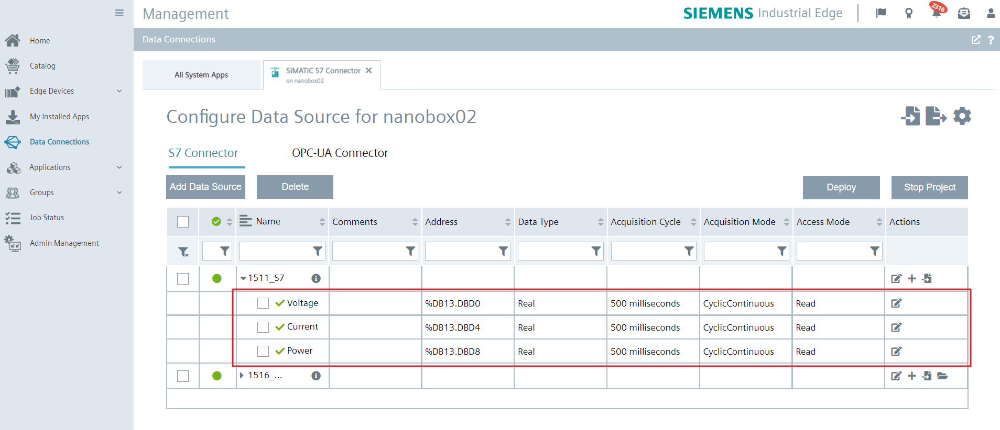

In Bulk Publish mode, when S7 Connector performs a data reading, only one MQTT topic is used. On this topic will be published all the variables that have undergone a change of value in the configured cycle time (*CyclicOnChange* mode).

The data read from the configured variables will then be available through the SIMATIC IE Databus application using the MQTT topic dedicated to the configured datasource (`1511_S7` in this example), which will cyclically emit a JSON message containing the `vals` property: an array with all the properties of the variables read.

Below an example of a JSON message obtained from S7 Connector via MQTT when reading the variables:

```bash
{
  "topic":"ie/d/j/simatic/v1/s7c1/dp/r/1511_S7/default",
  "payload":{
    "seq":181799,
    "vals":[
      {
        "id":"825",
        "qc":3,
        "ts":"2021-12-14T19:14:55.003Z",
        "val":234.49998474121094
      },
      {
        "id":"826",
        "qc":3,
        "ts":"2021-12-14T19:14:55.003Z",
        "val":0.75
      },
      {
        "id":"827",
        "qc":3,
        "ts":"2021-12-14T19:14:55.003Z",
        "val":175.87498474121094
      }
    ]
  },
  "qos":0,
  "retain":false,
  "_msgid":"ca72bc96.547e7"
}
```

The following table specifies the meaning of the typical properties of the messages obtained by S7 Connector through MQTT protocol when reading the variables, with reference to the example message above:

| Property | Description | Example Value |
|----------|-------------|---------------|
| **topic** | MQTT topic of the received message. | ie/d/j/simatic/v1/s7c1/dp/r/1511_S7/default |
| **payload** | Body of the message, containing all properties populated by S7 Connector. | `{"seq": 181799, "vals": [...] }` |
| **seq** | Progressive number of the read sequence. Each new read increments this number by 1. | 181799 |
| **vals** | Array containing all variables read in a loop and their properties. | `[{"id": "825", "qc": 3, "ts":"2021-12-14T19:14:55.003Z", "val":234.49998474121094}, .... ]` |
| **id** | ID of the variable configured within the S7 Connector app. | 825 |
| **qc** | Quality Code of reading. | 3 |
| **ts** | Timestamp in ISO86901 (yyyy-MM-ddThh:MM:ss) format. |"2021-12-14T19:14:55.003Z" |
| **val** | Value of the variable read. | 234.49998474121094 |

For more information on S7 Connector and IE Databus applications, or for more information on how to read variables via MQTT protocol, please consult the dedicated manuals:
* [SIMATIC S7 Connector Operating Manual](https://support.industry.siemens.com/cs/us/en/view/109783783)
* [SIMATIC IE Databus Operating Manual](https://support.industry.siemens.com/cs/us/en/view/109783784)
* [Edge Management Operation Manual](https://support.industry.siemens.com/cs/us/en/view/109793845)

#### ConnectionMap creation for Mapping Name Tag - Id Tag

As described in the previous paragraph, all messages received on the topic data are characterized by three properties: *name* (description of the tag), *id* (unique identification number assigned by the S7 Connector Configurator to each configured tag) and *dataType* (data type of the tag).

The correspondence between *id* and *name* of the various tags is visible within the MQTT message called **metadata**, that S7 Connector Configurator sends to each MQTT client connected to the specified topic (`ie/m/j/simatic/v1/s7c1/dp`) and that is updated every time the data source configuration in S7 Connector is modified.

Below an example of an **MQTT metadata message** received:

```bash
{
  "topic":"ie/m/j/simatic/v1/s7c1/dp",
  "payload":{
    "seq":3,
    "connections":[
      {
        "name":"1511_S7",
        "type":"S7",
        "dataPoints":[
          {
            "name":"default",
            "topic":"ie/d/j/simatic/v1/s7c1/dp/r/1511_S7/default",
            "publishType":"bulk",
            "dataPointDefinitions":[
              {
                "name":"Voltage",
                "id":"825",
                "dataType":"Real"
              },
              {
                "name":"Current",
                "id":"826",
                "dataType":"Real"
              },
              {
                "name":"Power",
                "id":"827",
                "dataType":"Real"
              }
            ]
          }
        ]
      }
    ]
  }
}
```

An example of data reading in an **MQTT data message** is the following:

```bash
{
  "topic":"ie/d/j/simatic/v1/s7c1/dp/r/1511_S7/default",
  "payload":{
    "seq":181799,
    "vals":[
      {
        "id":"825",
        "qc":3,
        "ts":"2021-12-14T19:14:55.003Z",
        "val":234.49998474121094
      },
      {
        "id":"826",
        "qc":3,
        "ts":"2021-12-14T19:14:55.003Z",
        "val":0.75
      },
      {
        "id":"827",
        "qc":3,
        "ts":"2021-12-14T19:14:55.003Z",
        "val":175.87498474121094
      }
    ]
  },
  "qos":0,
  "retain":false,
  "_msgid":"ca72bc96.547e7"
}
```

As visible in the message above, each tag read is identified exclusively by a unique *id*, without any indication of the *name* of the tag configured within the S7 Connector Configurator application. This can make it difficult, during the data reading phase, to recognize the configured tags.

To facilitate the reading and recognition of the configured variables, in the **[flows_S7toCSV.json](examples/flows_S7toCSV.json)** file of the application example provided, there is a flow of IE Flow Creator which, starting from the MQTT metadata message (*mqtt-in* node below), has the aim to map the *id* and *name* of the configured tags.

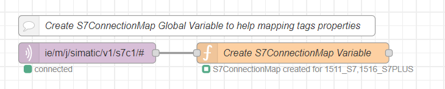

To do this, the flow uses a function (*function* node - *Create S7 ConnectionMap Variable*) which saves *Map* type objects within the global variable **S7ConnectionMap**, that are key-value pairs (*id-name* or *name-id* of the tags) sorted according to the insertion order of the various pairs within the variable. The content of the function node is the following:

```bash
// Create an object containing each S7 Connector connection property with different Map Objects to create correspondence between Tags IDs, Names and Types. Initialize the connections Mapping Object.
let S7ConnectionMap = {
    "nameList":[],   // array of available S7 Connections names. Order is the same in Map objects below.
    "typeList":[],   // array of available S7 Connections types. Order is the same of nameList.
    "nameIDMaps":[], // array of Tags Names-IDs object. Order is the same of nameList.
    "IDnameMaps":[], // array of Tags IDs-Names Map object. Order is the same of nameList.
    "IDTypeMaps":[]  // array of Tags IDs-Type Map object. Order is the same of nameList.    
}

// Check Payload
let m = msg.payload;
if (m.seq == undefined) {
    // Update global maps
    flow.set("S7ConnectionMap", null);
    // Update function node status
    node.status({fill:"red",shape:"ring",text:"S7Map cannot be created"});
    
    return null;
}  

// Iterate through connections
for (let i = 0; i < m.connections.length; i++)
{
    let connection = m.connections[i];
    // Push connection name and type in global object
    S7ConnectionMap.nameList.push(connection.name);
    S7ConnectionMap.typeList.push(connection.type);
    // Initiate maps
    let nameIDMap = new Map();
    let IDNameMap = new Map();
    let IDTypeMap = new Map();
    
    // Iterate through dataPoints
    let dataPoints = connection.dataPoints;
    for (let j = 0; j < dataPoints.length; j++)
    {
        let dataPoint = dataPoints[j];
        // Iterate through dataPointDefinitions
        let dataPointDefinitions = dataPoint.dataPointDefinitions;
        for (let k = 0; k < dataPointDefinitions.length; k++)
        {
            let dataPointDefinition = dataPointDefinitions[k];
            // push in maps the datapoint property
            nameIDMap.set(dataPointDefinition.name, dataPointDefinition.id);
            IDNameMap.set(dataPointDefinition.id, dataPointDefinition.name);
            IDTypeMap.set(dataPointDefinition.id, dataPointDefinition.dataType);        
        }
    }
    // Push mappings in global object
    S7ConnectionMap.nameIDMaps.push(nameIDMap);
    S7ConnectionMap.IDnameMaps.push(IDNameMap);
    S7ConnectionMap.IDTypeMaps.push(IDTypeMap);
}

// Update global maps
flow.set("S7ConnectionMap", S7ConnectionMap);

// Set S7Map as output payload
msg.payload = S7ConnectionMap;

// Update function node status
node.status({fill:"green",shape:"ring",text:"S7ConnectionMap created for " + S7ConnectionMap.nameList.join()});

return msg;
```

To use the `S7ConnectionMap` global variable for subsequent processing within a new function node, it is first necessary to extract the S7ConnectionMap global variable and the index relating to the datasource of interest (in this specific case the PLC `1511_S7`).

```bash
let S7ConnectionMap = flow.get("S7ConnectionMap");
let connectionIndex = S7ConnectionMap.nameList.indexOf("1511_S7");
```

Once the `S7ConnectionMap` global variable is available, it is possible to obtain the *name-id* map of the configured tags using the following line of code:

```bash
let nameIDMap = S7ConnectionMap.nameIDMaps[connectionIndex];
```

To obtain instead the *id-name* map of the configured tags:

```bash
let IDNameMap = S7ConnectionMap.IDnameMaps[connectionIndex];
```

The *id* of a specific tag can be extracted from the `nameIDMap` map starting from its *name*, for example `Voltage`. The output of the line of code shown below will be `825`, which is the *id* associated to the tag with *name* `Voltage`.

```bash
let tagId = nameIDMap.get("Voltage");
```

To obtain instead the *name* of a specific tag starting from its *id*, it will be sufficient to extract it from the `IDnameMap` map, using the key (id) of interest, for example `825`. The output of the line of code shown below will be `Voltage`, that is the *name* associated with the tag with *id* `825`.

```bash
let tagName = IDnameMap.get("825");
```

### Writing data from IE Databus with MQTT protocol to CSV file

Once the variables to be exchanged with the PLC data source have been configured within the S7 Connector application, the IE Flow Creator application can be used to collect data from the defined data source, process data and save them into a CSV file by the mean of the flow visible in the image below, supplied together with this application example.

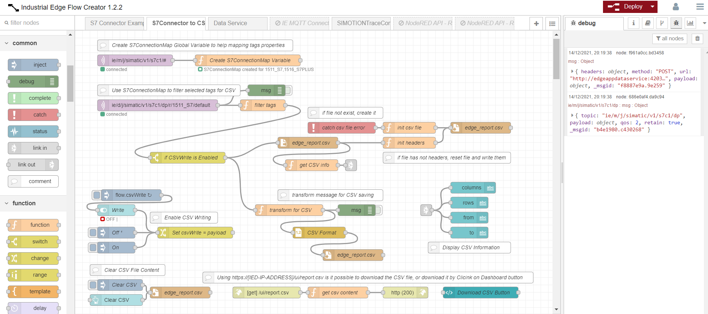

Before starting to actually save the data collected into a CSV file, it is first necessary to create the mapping between tags names and ids, as explained in the previous paragraph. This operation is performed by the flow highlighted below.


All further operations and data pre-processing are performed by the flow in the image below, explained in details in the following paragraphs.

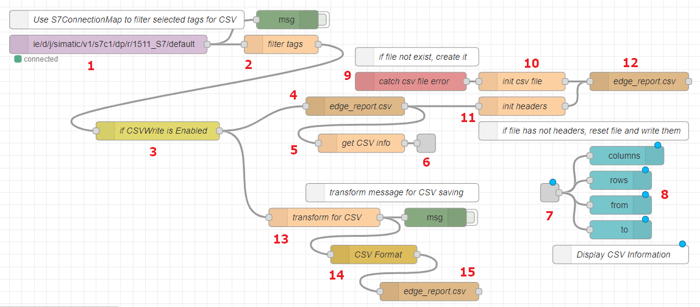

All nodes described in the following paragraphs will be referred to by using the enumeration of the figure above.

#### Bulk message receiving from MQTT

Within the flow of IE Flow Creator provided with the application example, the reading of the data from S7 Connector is carried out via an *mqtt-in* node (1), which subsequently sends the message content to a *function* node (2) that uses flow variable `S7ConnectionMap` to find the index of the connection of interest (`1511_S7`) and to filter the tags of interest (`Voltage`, `Current`, `Power`).

Through the *mqtt-in* node (1), Flow Creator connects to the **Broker MQTT IE Databus**, using the topic dedicated to the PLC configured for the purpose, in this example `1511_S7`:

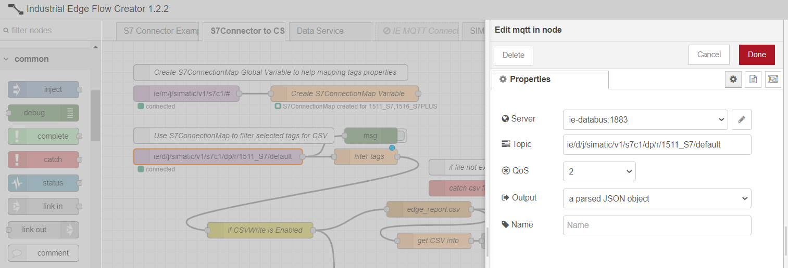

On the topic indicated in the figure, at each reading cycle, we will receive messages from MQTT IE Databus, containing all the data read by the S7-1500 PLC configured within the S7 Connector application. The name of the configured PLC is part of the topic to be subscribed.

Below an example of the output of the *mqtt-in* node:

```bash
{
  "topic":"ie/d/j/simatic/v1/s7c1/dp/r/1511_S7/default",
  "payload":{
    "seq":181799,
    "vals":[
      {
        "id":"825",
        "qc":3,
        "ts":"2021-12-14T19:14:55.003Z",
        "val":234.49998474121094
      },
      {
        "id":"826",
        "qc":3,
        "ts":"2021-12-14T19:14:55.003Z",
        "val":0.75
      },
      {
        "id":"827",
        "qc":3,
        "ts":"2021-12-14T19:14:55.003Z",
        "val":175.87498474121094
      }
    ]
  },
  "qos":0,
  "retain":false,
  "_msgid":"ca72bc96.547e7"
}
```

To connect to the SIMATIC IE Databus MQTT broker, a user needs to be configured and enabled for data exchange. In this case it was configured using the following parameters:

|**IE Databus Address**|**IE Databus Port**|**IE Databus User**|**IE Databus Password**|
|----------------------|-------------------|-------------------|-----------------------|
ie-databus	|1883	|edge	|edge|

The user above is configured both in IE Databus application and in IE Flow Creator application, within the settings of *mqtt-in* node, as shown below:

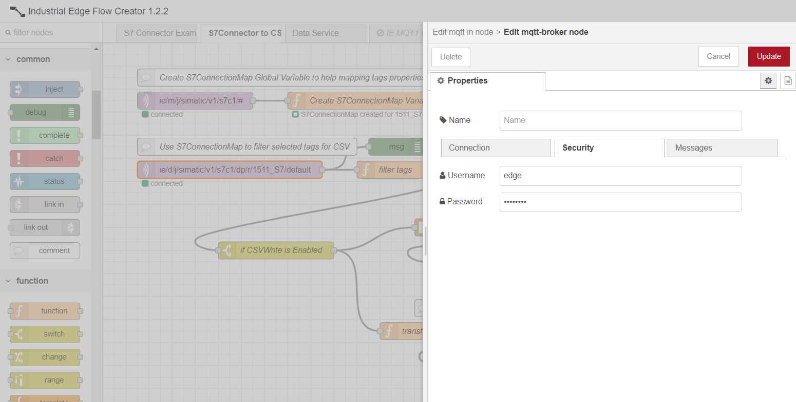

When using topic `ie/d/j/simatic/v1/s7c1/dp/r/1511_S7/default` to read the collected data, all tags defined in S7 Connector Configurator for data source `1511_S7` will be acquired. In order to get only the variables of interest, a certain data pre-processing needs to be performed. 

As can be seen from the Javascript code below, the aim of the *filter tags* node (2) is to filter the data collected by the *mqtt-in* node (1) and create an output message containing only the datapoints of the tags of interest. The output message will be formatted in an easy readable way, fitting the standard required by the CSV node further used.

```bash
let S7ConnectionMap = flow.get("S7ConnectionMap");

// Find index of 1511_S7 connection
let connectionIndex = S7ConnectionMap.nameList.indexOf("1511_S7");

// Use the index to get the right map
let nameIDMap = S7ConnectionMap.nameIDMaps[connectionIndex];

// Tags to be filtered
let tagList = ["Voltage", "Current", "Power"];

// Init out message
let outMsg = {"payload":[]};

// Iterate through readed datapoints
for (let i=0; i < msg.payload.vals.length; i++)
{
    for(let j=0; j < tagList.length; j++)
    {
        // Search for the ID that correspond to our tag name
        if (msg.payload.vals[i].id == nameIDMap.get(tagList[j]))
        {
            // Push to out array
            outMsg.payload.push({"name": tagList[j],
                         "value": msg.payload.vals[i].val,
                         "ts": msg.payload.vals[i].ts});
        }
    }
}

// Send out msg if something is found
if (outMsg.payload.length > 0)
{
    outMsg.columns = ["ts"].concat(tagList);
    return outMsg;
}
```
Below the example of an output message.

```bash
{
  "payload":
  [
    {
      "name":"Voltage",
      "value":236.8999786376953,
      "ts":"2021-12-15T10:50:54.013Z"
    },
    {
      "name":"Current",
      "value":1.25,
      "ts":"2021-12-15T10:50:54.013Z"
    },
    {
      "name":"Power",
      "value":296.1249694824219,
      "ts":"2021-12-15T10:50:54.013Z"
    }
  ],
  "columns":
  [
    "ts",
    "Voltage",
    "Current",
    "Power"
  ],
  "_msgid":"1f220b49.673805"
}
```

#### CSV file writing
When the *filter tags* node (2) output message arrives, it is used as input of a *switch* type node. This node (3) allows the definition of a set of rules and evaluates each of the defined rules, forwarding the received message to the corresponding outputs of any matching rules.

In this case, the rule defined is that flow variable `csvWrite` should be set to `True`. This flow variable is set in the flow explained in paragrah [Dashboard for displaying CSV monitoring with IE Flow Creator](#dashboard-for-displaying-CSV-monitoring-with-IE-Flow-Creator) and defines whether CSV file writing is enabled or not.

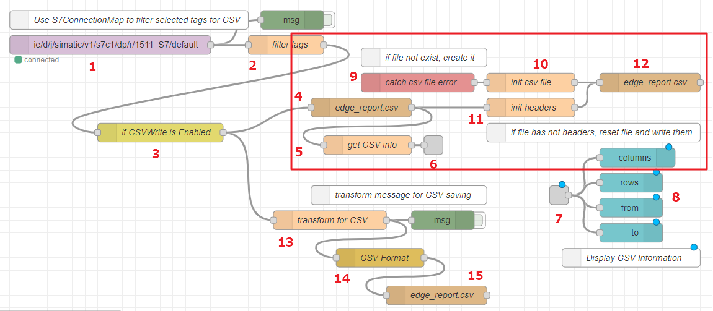

After having checked this setting, the flow highlighted in red in the image above, takes as input the *filter tags* (2) output message and creates a file named **edge_report.csv** into the **Application Volumes** of the IE device on which IE Flow Creator application is installed. 

The path in which the file will be saved is `/home/nodered/node-red-home/_CSV/edge_report.csv`, as defined in the configuration of *file* node (4).

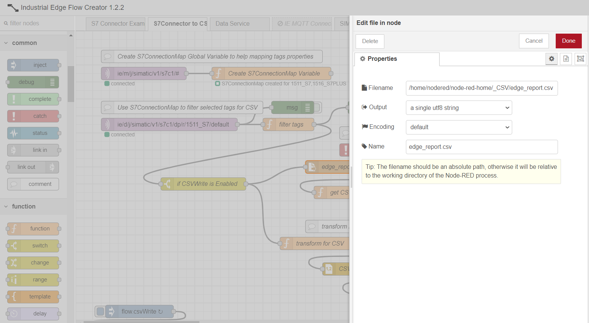

Once the file is available, it must be initialized with some headers, that will be the columns of the CSV file. 

For this purpose, function *init headers* node (11) gets the first row of CSV file and checks whether the columns names are equal or not to `msg.columns` content of the message received from *filter tags* (2) node. If not, `msg.columns` names are set as header and new CSV file is created through node (12). 

Below the body of function *init headers* node (11) for columns names initialization into CSV file.

```bash
// Get first row of csv 
let headers = msg.payload.split("\n")[0];

// Check if actual data columns are same as csv header
if (msg.columns.join(";") != headers)
{
    // If not, reset file and put header as first row
    node.send({"payload": msg.columns.join(";") +"\n"});
}
```

Nodes (9) and (10) are used instead to eventually catch errors that might raise up if CSV file does not exist yet while performing previously mentioned operations. 
Node (9) is in fact a *catch* type error, used to avoid flow halt if a node throws an error whilst handling a message. This node can be used to catch those errors and handle them with a dedicated flow.
In this flow, in case of errors, CSV file is created without headers.

Function node *get CSV info* (5) extracts information regarding the CSV file, such as number of rows, timstamp of first row inserted, timestamp of last row inserted and columns names, as can be seen from the code below.

```bash
// Save csv to flow.csvContent
flow.set("csvContent", msg.payload);

// Get all rows of csv 
let rows = msg.payload.split("\n");

if (rows[0] != "")
{
    // Count rows (last row is empty)
    let numRows = rows.length -1;
    // Get timerange
    let firstTime = rows[1].split(";")[0];
    let lastTime = rows[numRows - 2].split(";")[0];
    // Get columns
    let columns = rows[0]
    
    let statusText = "columns: " + columns +
                      ", rows: " + numRows +
                      ", from: " + firstTime +
                      ", to: " + lastTime;

    node.status({fill:"green",
                 shape:"ring",
                 text: statusText})       
                      
    node.send({"cols": columns,
               "rows": numRows,
               "from": firstTime,
               "to": lastTime})
}
```

This information will be shown in a monitoring dashboard of IE Flow Creator application, better explained in paragraph [Dashboard for displaying CSV monitoring with IE Flow Creator](#dashboard-for-displaying-CSV-monitoring-with-IE-Flow-Creator).

Once the CSV file is created with its headers, it is filled in with data collected from `1511_S7` data source, by previously formatting them in order to adapt them to the standard of NodeRED *csv* node (14).

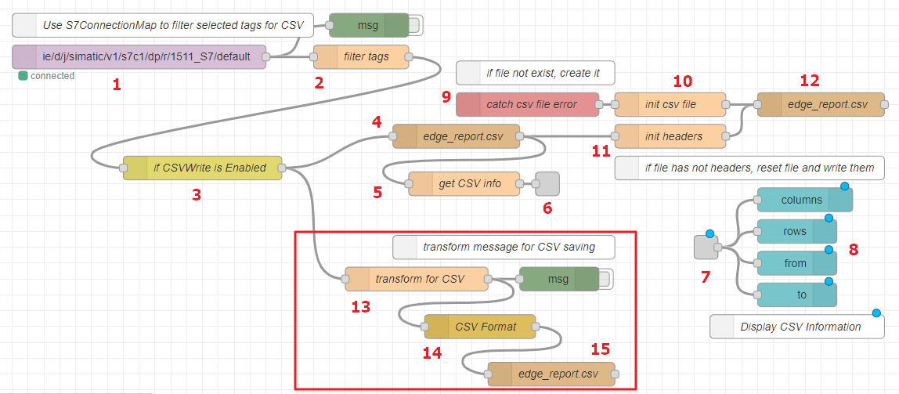

Data formatting is performed by *transform for CSV* function node (13), as shown below. 

```bash
// Init rows and timestamps temp array
let rows = {};
let timestamps = [];

for (let i=0; i < msg.payload.length; i++)
{
    // Get index of column based on tag name
    let nameIndex = msg.columns.indexOf(msg.payload[i].name);

    if(timestamps.indexOf(msg.payload[i].ts) == -1)
    {
        timestamps.push(msg.payload[i].ts);
        let nullRow = new Array(msg.columns.length -1).fill(null);
        rows[msg.payload[i].ts] = [msg.payload[i].ts].concat(nullRow);
    }
    // Timestamp is the key of rows objects.
    // Each row is an array, where each element is a value 
    // Where each index corresponds to column index
    rows[msg.payload[i].ts][nameIndex] = msg.payload[i].value;
}

msg.columns = msg.columns;
msg.payload = Object.values(rows);

return msg;
```

The code above will return a message containing as payload the timestamp and the values of the three tags of interest. Each message will be a row of the CSV file. Below an example of the output message obtained.

```bash
{
  "payload":
  [
    [
      "2022-01-07T10:43:31.182Z",
      232.09999084472656,
      0.25,
      58.02499771118164
    ]
  ],
  "columns":
  [
    "ts",
    "Voltage",
    "Current",
    "Power"
  ],
  "_msgid":"f2fbcfdd.421fb"
}
```

Each output message of node *transform to CSV* (13) will be converted into a CSV string by using NodeRED node *csv* (14). 

This node is able to convert between a CSV formatted string and its JavaScript object representation, in either direction. In the case of this application example, the node is used to build from a JavaScript object a CSV string, where each element of the string is separated by a semicolon.

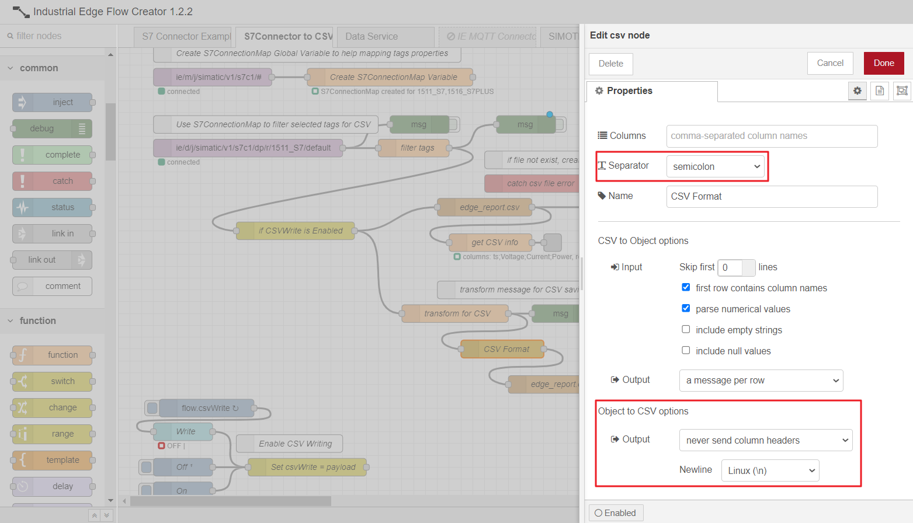

Through node (15) data collected are saved into CSV file previously created, named **edge_report.csv**.

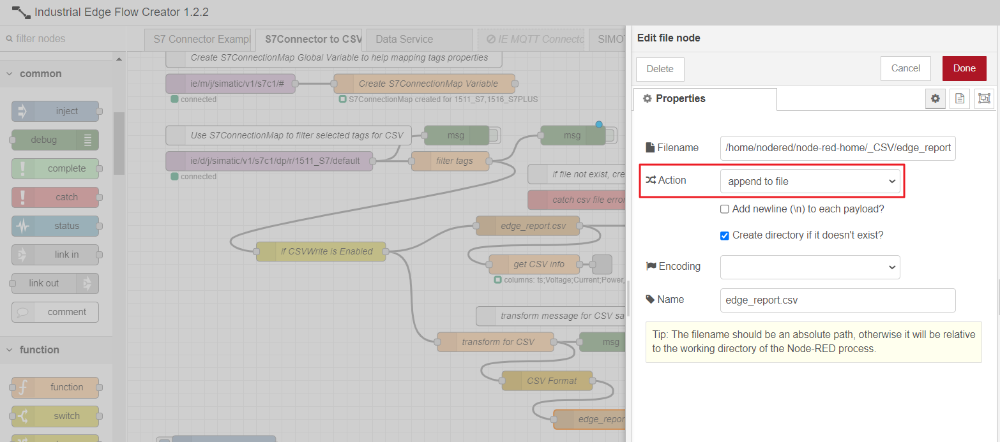

As can be seen from the image above, new data collected wil be appended to already existing file as new rows of the CSV.

#### Dashboard for displaying CSV monitoring with IE Flow Creator

To monitor, enable or disable CSV file writing, it is possible to use the **Web Dashboard functionality of IE Flow Creator** together with the nodes of the **node-red-dashboard** library, i.e. a series of nodes dedicated to different graphic objects such as gauges, text fields, graphics and much more.

In particular, in this application example **ui_switch**, **ui_button**, **ui_text** and **ui_template** nodes of node-red-dashboard library will be used in order to implement on the user interface the following controls: 
* A switch control to enable or disable CSV file writing;
* A button to clear out the CSV file;
* View non-editable text field with CSV file summary;
* A download button to download CSV file on local PC.

To open IE Flow Creator web dashboard the following link must be accessed: `https:/[device-ip-address]/ui/`.

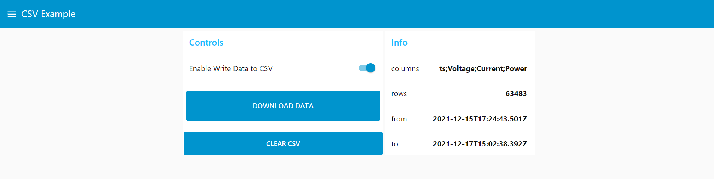

For more information on the node-red-dashboard library, please visit the [official documentation](https://flows.nodered.org/node/node-red-dashboard). 

From the dashboard shown above, the user can enable or disable CSV data writing through the dedicated switch control, or can download the CSV file with data collected until that very last moment. The summary of the collected data is shown on the right-hand side of the page, and the information collected are the one obtained as output of *get csv info* node (5):
- Names of the CSV columns: **ts** (timestamp), **Voltage**, **Current** and **Power**;
- Number or rows written in the CSV file;
- Start time of CSV file writing;
- End time of CSV file writing.

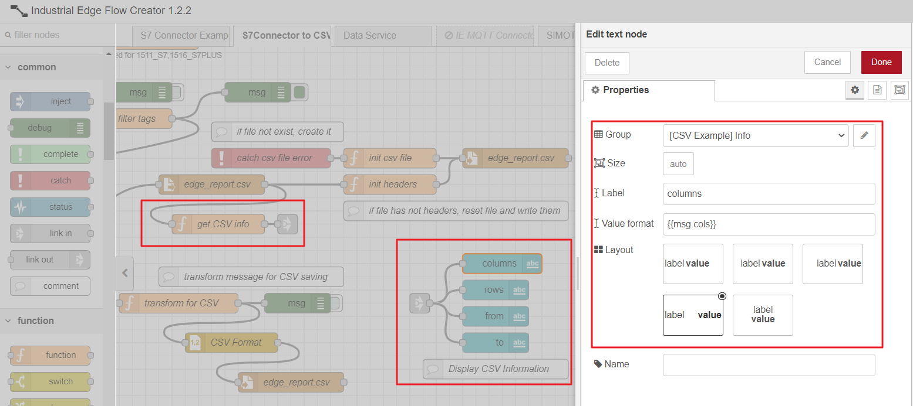

Whenever the CSV writing is enabled (`csvWrite` set to `True`), the number of written rows and the acquisition end time, will be continuously updated.

As can be seen below instead, the controls of the dashboard that allow to enable, download or clear the CSV file, are based respectively on *ui_switch*, *ui_template* and *ui_button* nodes. The user, instead of acting on the dashboard, can eventually act directly on *inject* nodes of the flows below to trigger and perform the mentioned operations.

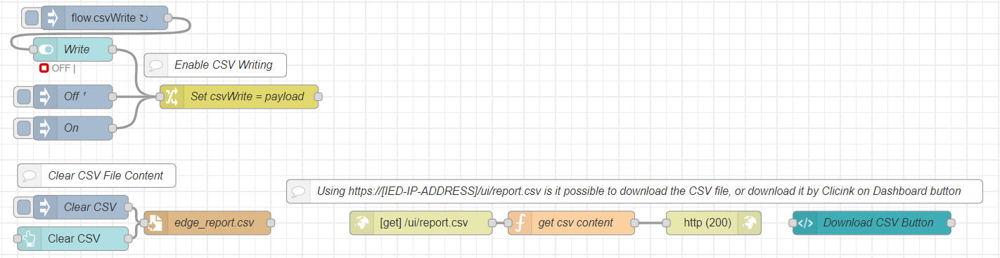

From the dashboard, once the **Download** data button is pressed, it will automatically trigger the CSV file download on local PC. The file, in this case, will appear as follows.

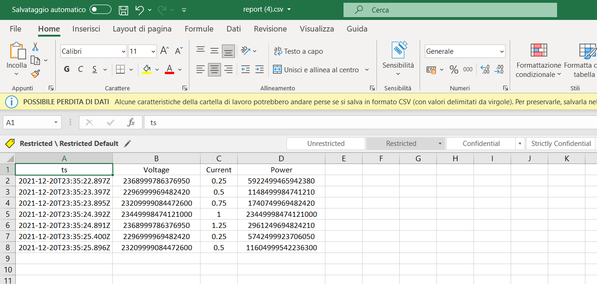

#### Download the CSV file from IED Application Volumes

edge_report.csv file will be saved in the **Application Volumes** of the IE Flow Creator application on the Edge Device on which the application is installed.

To download the file locally, either the download button of the dashboard (see previous paragraph) or the Application Volumes of the IE Device can be used. To download the file from the Application Volumes, you need to connect to the web page of the Edge Device, enter the `Management` section and select the IE Flow Creator application.

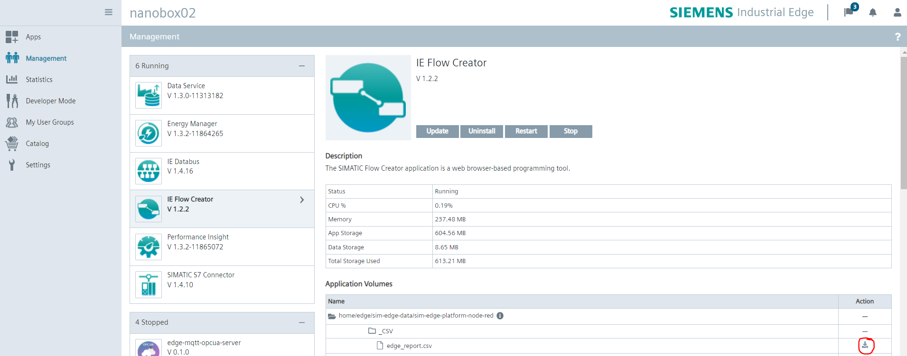

Under the path `home/edge/sim-edge-data/sim-edge-platform-node-red/_CSV/` the edge_report.csv file is available and downloadable through the download icon highligthed above.

## Documentation

You can find further documentation and help about Industrial Edge in the following links:

- [Industrial Edge Hub](https://iehub.eu1.edge.siemens.cloud/#/documentation)
- [Industrial Edge Forum](https://www.siemens.com/industrial-edge-forum)
- [Industrial Edge landing page](https://new.siemens.com/global/en/products/automation/topic-areas/industrial-edge/simatic-edge.html)
- [Industrial Edge GitHub page](https://github.com/industrial-edge)
- [Industrial Edge App Developer Guide](https://support.industry.siemens.com/cs/ww/en/view/109795865)
- [SIMATIC S7 Connector Configurator](https://support.industry.siemens.com/cs/document/109795606/simatic-s7-connector-configurator-v1-2?dti=0&lc=en-US)
- [Industrial Edge Flow Creator](https://support.industry.siemens.com/cs/document/109794331/industrial-edge-flow-creator?dti=0&lc=en-US)

## Contribution

Thanks for your interest in contributing. Anybody is free to report bugs, unclear documentation, and other problems regarding this repository in the Issues section or, even better, is free to propose any changes to this repository using *Merge Requests*.

## License & Legal Information

Please read the [Legal Information](LICENSE.md).
